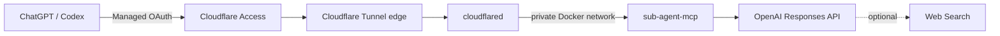

# sub-agent-mcp

Host LLM から独立した推論コンテキストを呼び出す、読み取り専用の Remote MCP サービスです。
単独委譲の `delegate` と、3 worker + synthesis の `parallel_delegate` を提供します。

Self-hosted Remote MCP server for isolated reasoning, review, and optional web research.

運用中のエンドポイント: `https://subagent.full-ranges.com/mcp`

このエンドポイントは Cloudflare Access 認証が必要で、公開デモではありません。

## 特徴

- Node.js 24、TypeScript、MCP TypeScript SDK v2によるstateless Streamable HTTP
- 単独実行と、相互に結果を共有しない3 workerの実並列実行
- OpenAI Responses APIのStructured Outputs
- `disabled`、`auto`、`required`を選べるWeb Search
- 実際のWeb Search sourceとのサーバー側URL照合
- Cloudflare Tunnel + Managed OAuth + origin JWT再検証
- タイムアウト、同時実行数、待ち行列、呼び出し頻度、入力サイズのhard limit

## 構成



アプリケーションのポートはホストへpublishせず、`cloudflared`と同じprivate Docker
network内だけで公開します。

## MCP Tools

単独の推論・レビュー・調査：

```json
{
  "objective": "この設計の最大のリスクを指摘してください",
  "mode": "review",
  "web": "disabled",
  "depth": "quick"
}
```

3つの独立した視点を並列実行して合成：

```json
{
  "objective": "複数の選択肢を比較し、推奨案を決めてください",
  "questions": ["主要なトレードオフは何か"],
  "mode": "reason",
  "web": "disabled",
  "depth": "standard"
}
```

前者を`delegate`、後者を`parallel_delegate`のargumentsとして渡します。`research`
modeはWeb Searchが既定で`required`になります。

## ローカル開発

必要環境は Node.js 24 と npm です。リポジトリ直下の `.env` に
`OPENAI_API_KEY` を設定します（Git 管理対象外）。

```bash
cp .env.example .env
npm ci
npm run check
npm start
```

ローカルでは既定で `AUTH_MODE=dev` となり、MCP 接続は loopback からだけ許可されます。
`npm run test:integration` は任意です。実際のOpenAI APIを呼び出して課金が発生します。

## 本番構成

`/opt/sub-agent-mcp` で Docker Compose を実行します。デプロイスクリプトの接続先は
`DEPLOY_HOST`で指定でき、未指定時は`myserver`です。アプリのポートはホストへ公開せず、
同一 Compose network 上の `cloudflared` だけが接続します。

本番で必要なローカルファイルは次の3つです。いずれも Git 管理しません。

```text
.env.production
secrets/openai_api_key
secrets/cloudflare_tunnel_token
```

`.env.production.example` をコピーし、Cloudflare Access の Team domain、Application
Audience (AUD) Tag、secret 読み取り用 group ID を設定します。秘密値は改行で終わる
1行のファイルとして `secrets/` に置きます。

```bash
sudo groupadd --system sub-agent-mcp
sudo install -d -o root -g sub-agent-mcp -m 0750 /opt/sub-agent-mcp/secrets
sudo install -o root -g sub-agent-mcp -m 0440 /path/to/openai-key /opt/sub-agent-mcp/secrets/openai_api_key
sudo install -o root -g sub-agent-mcp -m 0440 /path/to/tunnel-token /opt/sub-agent-mcp/secrets/cloudflare_tunnel_token
getent group sub-agent-mcp
```

`getent` の3列目に表示される数値を `SUB_AGENT_SECRETS_GID` に設定します。

## デプロイ

ソースを同期します。`.env.production` と `secrets/` は同期・削除の対象外です。

```bash
DEPLOY_HOST=your-server ./deploy/deploy.sh
ssh your-server 'cd /opt/sub-agent-mcp && docker compose --env-file .env.production up -d --build'
```

確認:

```bash
ssh your-server 'cd /opt/sub-agent-mcp && docker compose --env-file .env.production ps'
ssh your-server 'cd /opt/sub-agent-mcp && docker compose --env-file .env.production logs --tail=100'
```

## Cloudflare

1. remotely-managed Tunnel を新規作成し、token を secret file に保存する。
2. 利用するPublic hostname（運用例では`subagent.full-ranges.com`）のserviceを
   `http://sub-agent-mcp:3000` にする。
3. 同じ hostname に Cloudflare Access の MCP server application を作る。
4. Allow policy を対象ユーザーだけに限定し、Advanced settings の Managed OAuth を有効にする。
5. Application Audience (AUD) Tag と Team domain を `.env.production` へ設定する。

origin は `Cf-Access-Jwt-Assertion` の署名、issuer、audience を再検証します。
`GET /healthz` は Compose の内部 healthcheck 用です。Cloudflare 側では hostname 全体に
Access を適用します。

参考: [Managed OAuth](https://developers.cloudflare.com/cloudflare-one/access-controls/applications/http-apps/managed-oauth/)、[Access JWT validation](https://developers.cloudflare.com/cloudflare-one/access-controls/applications/http-apps/authorization-cookie/validating-json/)、[Tunnel run parameters](https://developers.cloudflare.com/tunnel/advanced/run-parameters/)

## 設定

主要な環境変数は `.env.production.example` を参照してください。API key は
`OPENAI_API_KEY_FILE` を優先し、Compose では `/run/secrets/openai_api_key` を使用します。

ログには objective、context、API key、Access JWT を出力しません。request ID、mode、
status、duration、token usage、web search count のみを構造化ログへ記録します。

OpenAI 呼び出しは同時6件、待ち行列24件、論理API呼び出し12件/分を既定上限とします。
`parallel_delegate` は3 worker + synthesisの最大4件分を開始時に予約します。Tool入力の
全文字数も既定250,000文字までに制限されます。必要なら対応する `MAX_*` 環境変数で
調整してください。
